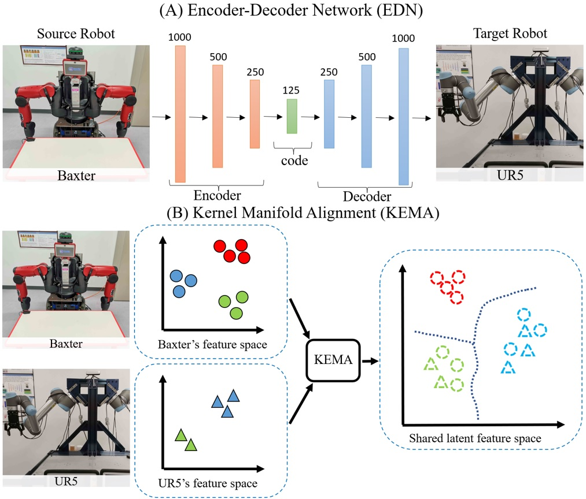
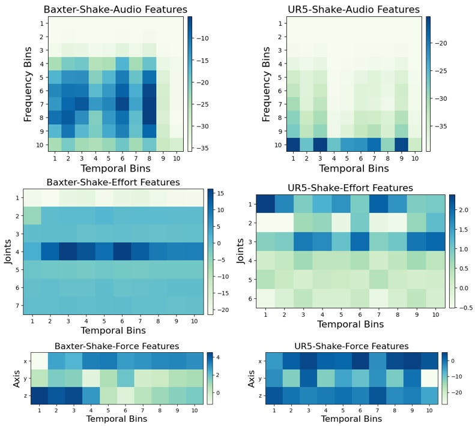
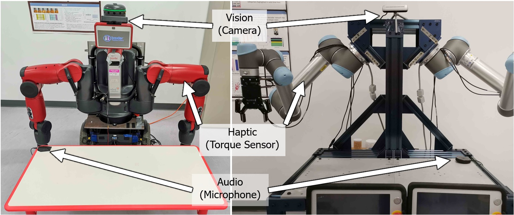
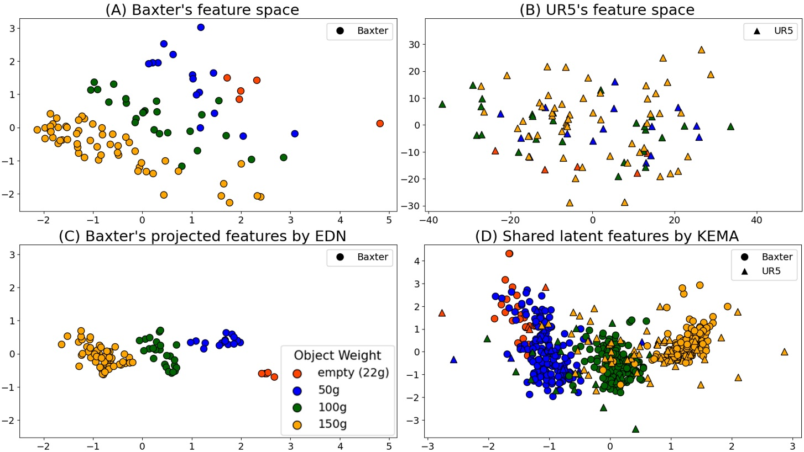
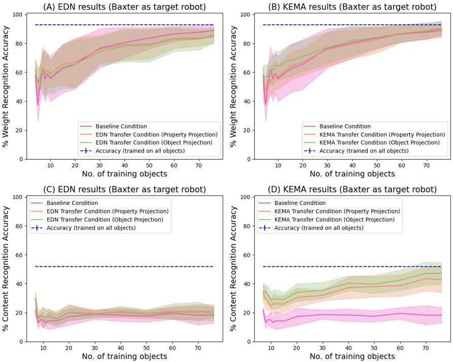
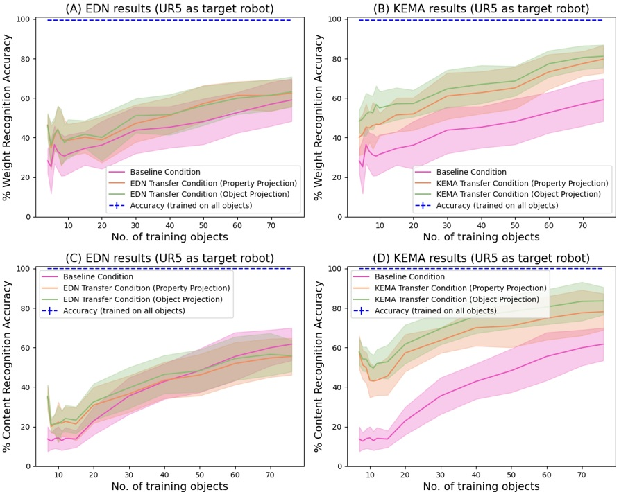
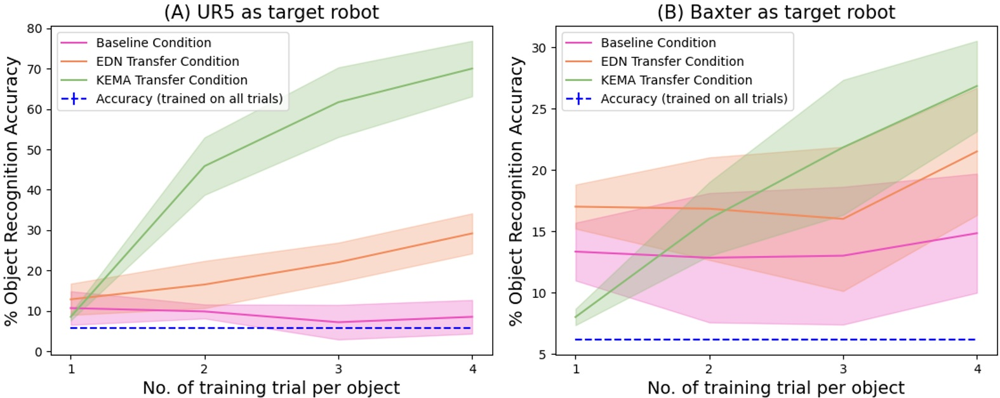

# Transferring Implicit Knowledge of Non-Visual Object Properties Across Heterogeneous Robot Morphologies

**Abstract:**

> Humans leverage multiple sensor modalities when interacting with objects and discovering their intrinsic properties. Using the visual modality alone is insufficient for deriving intuition behind object properties (e.g., which of two boxes is heavier), making it essential to consider non-visual modalities as well, such as the tactile and auditory. Whereas robots may leverage various modalities to obtain object property understanding via learned exploratory interactions with objects (e.g., grasping, lifting, and shaking behaviors), challenges remain: the implicit knowledge acquired by one robot via object exploration cannot be directly leveraged by another robot with different morphology, because the sensor models, observed data distributions, and interaction capabilities are different across these different robot configurations. To avoid the costly process of learning interactive object perception tasks from scratch, we propose a multi-stage projection framework for each new robot for transferring implicit knowledge of object properties across heterogeneous robot morphologies. We evaluate our approach on the object-property recognition and object-identity recognition tasks, using a dataset containing two heterogeneous robots that perform 7,600 object interactions. Results indicate that knowledge can be transferred across robots, such that a newly-deployed robot can bootstrap its recognition models without exhaustively exploring all objects. We also propose a data augmentation technique and show that this technique improves the generalization of models. We release  our code and datasets, here: https://github.com/gtatiya/Implicit-Knowledge-Transfer.

## Development Environment

`Python 3.7` and `MATLAB R2019b update 3 (9.7.0.1261785)` are used for development and following packages are required to run the code:  

### Python Dependencies
`pip install scipy==1.7.3` 
`pip install scikit-learn=1.0.2` 
`pip install numpy==1.21.6` 
`pip install tensorflow-gpu==1.15.0` 
`pip install matplotlib==3.5.2` 
`MATLAB Engine API for Python`

### MATLAB Dependencies
`Statistics and Machine Learning Toolbox`

## [Dataset]

- [Download the dataset](https://tufts.box.com/s/t4apxhxtti6tlo9p875xtp823rhx1x9i)
- Dataset details can be found on the [dataset webpage](https://www.eecs.tufts.edu/~gtatiya/pages/2022/Baxter_UR5_95_Objects_Dataset.html).

### Discretized Representation

- [Visualization of discretized modalities](DatasetVisualization.ipynb)  

### Dataset Collection

Baxter: https://youtu.be/OIxgTVXdX28  
UR5: https://youtu.be/I-2cBNgxEWc  

<table>

<tr>
<td>
	<a href="https://youtu.be/OIxgTVXdX28">Baxter</a>
	
</td>

<td>
	<a href="https://youtu.be/I-2cBNgxEWc">Fetch</a>
	
</td>
</tr>

</table>

## How to run the code?

### Object Property Recognition

EDN: `python obj_prop_EDN.py`  
KEMA: `python obj_prop_KEMA.py`  
Baseline: `python obj_prop_BL.py`

### Object Identity Recognition

EDN: `python obj_iden_EDN.py`  
KEMA: `python obj_iden_KEMA.py`  
Baseline: `python obj_iden_BL.py`

## Results

### Illustrative Example

### Object Property Recognition

#### Baxter as Target Robot

#### UR5 as Target Robot

### Object Identity Recognition

